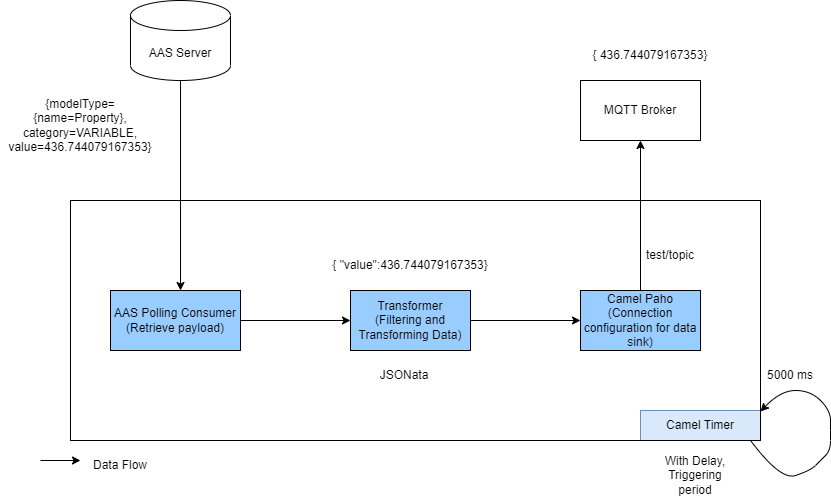

## "examples.aas-jsonata-mqtt" based on newly implemented **AAS Consumer**

- **AAS Consumer** consume data from data source and send these data to **Data Sink (MQTT Broker)** via **JSONata** transformer

- There are two types use case based on `aasserver_datasource.json` configuration
  - With properties (Such as `pressure`, `rotation`)
  - Without properties
 
- With idShortPath's basic workflow

- Blank idShortPath's basic workflow

